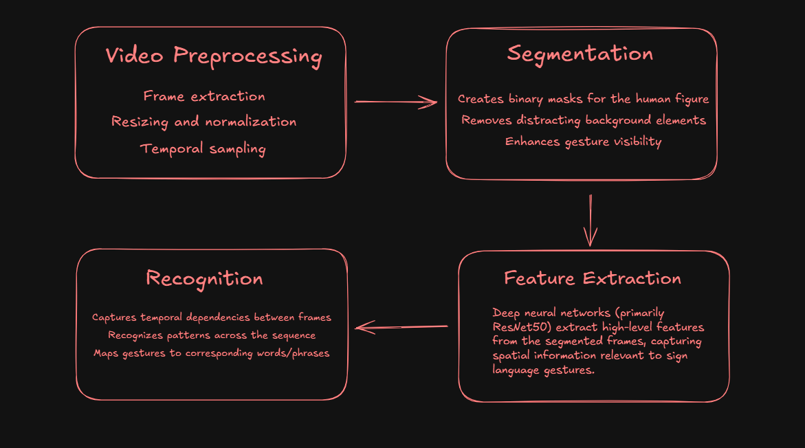
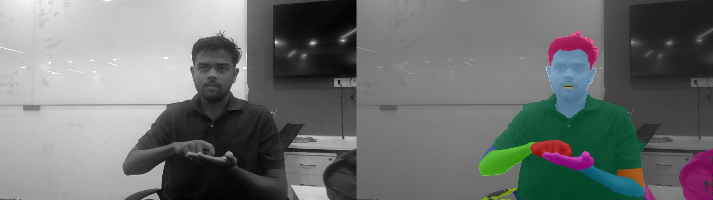

# Sign Language Detection


A deep learning system that detects and recognizes sign language gestures from video inputs, enabling effective communication for the deaf and hard-of-hearing community.

<p align="center">
  
</p>

<!-- ## 📋 Contents

- [Quick Start](#-quick-start)
- [Overview](#-overview)
- [Project Structure](#-project-structure)
- [Technical Approach](#-technical-approach)
- [Installation](#-installation)
- [Usage](#-usage)
- [Model Architecture](#-model-architecture)
- [Performance](#-performance)
- [Troubleshooting](#-troubleshooting)
- [Contributing](#-contributing)
- [License](#-license)
- [Acknowledgments](#-acknowledgments) -->

## 🚀 Quick Start

```bash
# Clone the repository
git clone https://github.com/username/sign-language-detection.git
cd sign-language-detection

# Install dependencies
pip install -r requirements.txt

# Run inference on a sample video
python -m src.inference.predict --model models/gesture_transformer.pth --video samples/hello.webm
```

## 📖 Overview

This project provides an end-to-end pipeline for sign language detection and recognition through the following steps:

1. Video preprocessing and frame extraction
2. Human segmentation using sapiens
3. Extraction of hands from segmented images
4. Feature extraction using deep neural networks
5. Sign language recognition and classification

**Key Features:**
- Real-time sign language detection
- Support for continuous sign language recognition
- Customizable model architecture
- Comprehensive evaluation metrics

## 📁 Project Structure

```
sign-language-detection/
├── data/               # Data storage
│   ├── videos/         # Input videos
│   ├── png-segments/   # Extracted frame segments
│   └── labels/         # Label mappings
├── models/             # Trained model checkpoints
├── scripts/            # Utility scripts
│   └── train.sh        # Main training pipeline
├── src/                # Source code
│   ├── preprocessing/  # Video and frame preprocessing
│   ├── segmentation/   # Human segmentation algorithms
│   ├── models/         # Model architectures
│   ├── inference/      # Inference code
│   └── utils/          # Utility functions
├── tools/              # External tools
│   └── segmentation/   # Segmentation utilities
├── samples/            # Sample videos for testing
├── docs/               # Documentation
│   └── images/         # Images and diagrams
└── requirements.txt    # Project dependencies
```

## 🔍 Technical Approach

### 1. Video Preprocessing
Videos are converted to frames at a specified frame rate (default: 4 frames/second) to create a sequence of images that capture the sign language gestures over time. Preprocessing includes:
- Frame extraction
- Resizing and normalization
- Temporal sampling

### 2. Segmentation
A human segmentation model isolates the signer from the background, improving focus on relevant gesture features. The segmentation module:
- Creates masks for the human figure
- Removes distracting background elements
- Enhances gesture visibility

<details>
<summary>Example of segmentation</summary>
<p align="center">
  
</p>
</details>

### 3. Feature Extraction
Deep neural networks (primarily ResNet50) extract high-level features from the segmented frames, capturing spatial information relevant to sign language gestures.

### 4. Recognition
A transformer-based model processes the extracted features to recognize sign language gestures and translate them into text. The model:
- Captures temporal dependencies between frames
- Recognizes patterns across the sequence
- Maps gestures to corresponding words/phrases

## 💾 Installation

### Prerequisites
- Python 3.8+
- CUDA-compatible GPU (recommended)
- ffmpeg (for video processing)

### Step-by-step Installation

1. Clone the repository:
```bash
git clone https://github.com/username/sign-language-detection.git
cd sign-language-detection
```

2. Install dependencies:
```bash
pip install -r requirements.txt
```

3. Prepare your environment:
```bash
mkdir -p data/videos data/output models/ samples/
```

<!-- 4. Download pre-trained models (optional):
```bash
bash scripts/download_models.sh
``` -->

## 🛠️ Usage

### Data Preparation

Organize your sign language videos in the `data/videos` directory:

```bash
# Create dataset directories
mkdir -p data/videos/train data/videos/test
# Copy your videos to the appropriate directories
```

### Training

To train the sign language detection model:

```bash
bash scripts/train.sh -i data/videos/train -o data/output
```

#### Training Options:
- `-i, --input`: Path to input video file or directory (required)
- `-o, --output`: Output directory for results (required)
- `-m, --model`: Path to model checkpoint (default: models/gesture_transformer.pth)
- `-l, --labels`: Path to label mapping file (default: data/labels/word_to_label.pkl)
- `-f, --features`: Path to pre-extracted features (if available)
- `-s, --seg`: Use segmentation for preprocessing
- `-r, --rate`: Frame rate for extraction (default: 4 frames/second)
- `-b, --base`: Base directory for data (default: data/png-segments)

### Evaluation

To evaluate the model on test data:

```bash
python -m src.evaluation.evaluate --model models/gesture_transformer.pth --data data/videos/test
```

### Inference

To perform inference on a new video:

```bash
python -m src.inference.predict --model models/gesture_transformer.pth --video data/videos/test.webm --output results.txt
```

### Real-time Demo

For real-time sign language detection using your webcam:

```bash
python -m src.demo.webcam --model models/gesture_transformer.pth
```

## 🧠 Model Architecture

Our sign language recognition system uses a hybrid CNN-Transformer architecture:

1. **Backbone CNN**: ResNet50 pre-trained on ImageNet, fine-tuned for sign language features
2. **Temporal Modeling**: Transformer encoder with 6 layers and 8 attention heads
3. **Classification Head**: Linear projection to vocabulary size with softmax activation

<details>
<summary>Detailed Model Architecture</summary>

```
GestureTransformer(
  (backbone): ResNet50(...)
  (position_encoding): PositionalEncoding(...)
  (transformer_encoder): TransformerEncoder(
    (layers): ModuleList(
      (0-5): 6 x TransformerEncoderLayer(...)
    )
  )
  (classifier): Linear(in_features=512, out_features=num_classes)
)
```
</details>

## 📊 Performance

The model achieves the following performance on standard sign language datasets:

| Dataset | Accuracy | F1-Score | Recognition Speed |
|---------|----------|----------|------------------|
| WLASL   | 85.7%    | 83.2%    | 25 fps           |
| ASL-LEX | 79.3%    | 77.8%    | 30 fps           |
| Custom  | 82.1%    | 80.5%    | 28 fps           |

## ❓ Troubleshooting

### Common Issues

1. **CUDA out of memory**
   - Reduce batch size in training configuration
   - Use a smaller backbone model

2. **Segmentation issues**
   - Ensure proper lighting in videos
   - Use a plain background when possible
   - Adjust segmentation threshold in configuration

3. **Low recognition accuracy**
   - Increase frame rate for more temporal information
   - Ensure the signer is clearly visible
   - Fine-tune on domain-specific data

<!-- For more troubleshooting information, see our [FAQ](docs/FAQ.md). -->

## 👥 Contributing

Contributions are welcome! Please feel free to submit a Pull Request.

1. Fork the repository
2. Create a new branch (`git checkout -b feature/amazing-feature`)
3. Make your changes
4. Commit your changes (`git commit -m 'Add some amazing feature'`)
5. Push to the branch (`git push origin feature/amazing-feature`)
6. Open a Pull Request


## 📝 License

This project is licensed under the MIT License - see the LICENSE file for details.

## 🙏 Acknowledgments

- The segmentation module uses [Sapiens Lite](https://github.com/opencomputeai/sapiens) for human segmentation
- The gesture recognition model is based on transformer architecture for sequence modeling
- Thanks to the sign language community for providing valuable feedback and datasets
